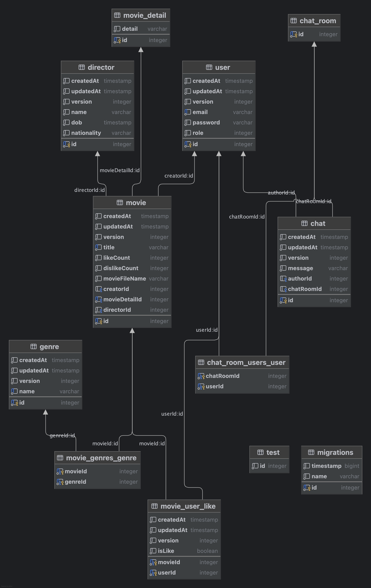

<p align="center">
  <a href="http://nestjs.com/" target="blank"></a>
</p>

<p align="center">
<a href="https://www.npmjs.com/~nestjscore" target="_blank"></a>
<a href="https://www.npmjs.com/~nestjscore" target="_blank"></a>
<a href="https://www.npmjs.com/~nestjscore" target="_blank"></a>
<a href="https://circleci.com/gh/nestjs/nest" target="_blank"></a>
<a href="https://coveralls.io/github/nestjs/nest?branch=master" target="_blank"></a>
<a href="https://discord.gg/G7Qnnhy" target="_blank"></a>
<a href="https://opencollective.com/nest#backer" target="_blank"></a>
<a href="https://opencollective.com/nest#sponsor" target="_blank"></a>
  <a href="https://paypal.me/kamilmysliwiec" target="_blank"></a>
    <a href="https://opencollective.com/nest#sponsor"  target="_blank"></a>
  <a href="https://twitter.com/nestframework" target="_blank"></a>
</p>

## NestJs Test API Documentation

## Todo
- ~~업로드한 정적 파일 리스트 불러오기~~ [v]
- 업로드한 정적 파일 nginx로 전송하기
- s3 업로드파일 cdn으로 전송하기

## swagger doc
<p>https://ceramic-tager.store/doc</p>

<p>open time: 11:00 ~ 20:00 (utc +9)</p>

## tech stack

<p>language, framework, server</p>


<p>database</p>


<p>development tool & publish</p>


## schema


## Project setup

```bash
$ pnpm install
```

## Compile and run the project

```bash
# development
$ pnpm run start

# watch mode
$ pnpm run start:dev #(3000 port)

# watch mode worker
$ pnpm run start:dev:worker #(3001 port)

# production mode
$ pnpm run start:prod

# production mode worker
$ pnpm run start:prod:worker #(3001 port)

```
## Deployment

When you're ready to deploy your NestJS application to production, there are some key steps you can take to ensure it runs as efficiently as possible. Check out the [deployment documentation](https://docs.nestjs.com/deployment) for more information.

If you are looking for a cloud-based platform to deploy your NestJS application, check out [Mau](https://mau.nestjs.com), our official platform for deploying NestJS applications on AWS. Mau makes deployment straightforward and fast, requiring just a few simple steps:

```bash
$ pnpm install -g mau
$ mau deploy
```

With Mau, you can deploy your application in just a few clicks, allowing you to focus on building features rather than managing infrastructure.

# server descripton

<details> <summary><strong>서버 정보</strong></summary>

- 서버 실행시간: 11:00 ~ 20:00

- Swagger 문서: [https://ceramic-tager.store/doc](https://ceramic-tager.store/doc)

- 미디어 생성 서버: 3000 port

- 영상 편집 서버: 3001 port


</details> <details> <summary><strong>영화 (Movie)</strong></summary>

- 영화 목록 불러오기

- 영화 생성하기

- 최신 영화 리스트 가져오기

- 영화 불러오기

- 영화 수정하기

- 영화 삭제하기

- 영화 좋아요

- 영화 싫어요


</details> <details> <summary><strong>공통 기능 (Common)</strong></summary>

- presigned-url 생성

- 서버 폴더에 비디오 파일 업로드

- 업로드파일 serve-static으로 접근하기

- serve-static으로 접근가능한 영상 목록 보기

- 비디오파일 s3 temp폴더 업로드


</details> <details> <summary><strong>영화 감독 (Director)</strong></summary>

- 영화 감독 생성하기

- 영화 감독 목록 불러오기

- 영화 감독 불러오기

- 영화 감독 변경하기

- 영화 감독 제거하기


</details> <details> <summary><strong>영화 장르 (Genre)</strong></summary>

- 영화 장르 생성하기

- 영화 장르 목록 불러오기

- 영화 장르 가져오기

- 영화 장르 변경하기

- 영화 장르 제거하기


</details> <details> <summary><strong>인증 (Auth)</strong></summary>

- 사용자 회원가입

- 사용자 로그인

- 사용자 로그인 passport 방식

- 사용자 토큰 갱신하기


</details> <details> <summary><strong>사용자 (User)</strong></summary>

- 사용자 목록 불러오기

- 사용자 불러오기

- 사용자 업데이트

- 사용자 제거하기


</details> <details> <summary><strong>헬스 체크 (Health)</strong></summary>

- load balancer 헬스체크


</details> 
