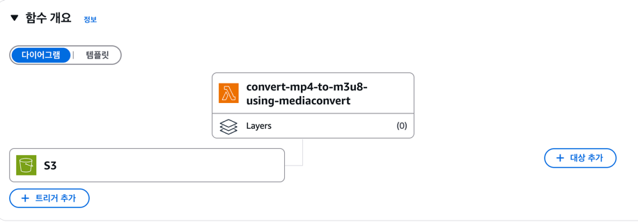
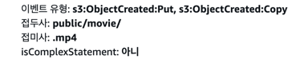

### s3 트리거
- s3 파일 업로드, 파일이동(복사) 이벤트 감지



### 람다 함수 코드(index.mjs만 표시)
```js
// 엔드포인트 조회
const describeCommand = new DescribeEndpointsCommand({});
const endpoints = await mcClient.send(describeCommand);
const endpointUrl = endpoints.Endpoints[0].Url;

// S3 이벤트에서 버킷 이름과 객체 키 추출
const record = event.Records[0];
const srcBucket = record.s3.bucket.name;
const srcKey = decodeURIComponent(record.s3.object.key.replace(/\+/g, ' '));
const destFolder = srcKey.substring(0, srcKey.lastIndexOf('/') + 1);
console.log('destFolder', destFolder)
// MediaConvert 클라이언트 재생성
const mcClientWithEndpoint = new MediaConvertClient({
  region,
  endpoint: endpointUrl
});

// Job 생성 로직 (v3 SDK 방식)
const createJobParams = {
  JobTemplate: 'template name', // 템플릿 지정
  Role: 'arn:arn_Role',
  // 기존 job template에 설정 override 가능
  Settings: {
    Inputs: [{
      FileInput: `s3://${srcBucket}/${srcKey}`
    }],
    OutputGroups: [
      {
        OutputGroupSettings: {
          Type: "HLS_GROUP_SETTINGS",
          HlsGroupSettings: {
            Destination: `s3://convert-bucket-url/${destFolder}`
          }
        }
        // 필요시 Outputs 등 추가
      }
    ]
  }
};

const job = await mcClientWithEndpoint.send(new CreateJobCommand(createJobParams));
console.log('job', job)
};
``` 

### 작업 요청 본문 작성내용
```json
{
  "JobTemplate": "arn:aws:mediaconvert: job template url",
  "Queue": "arn:aws:mediaconvert: queues/Default",
  "UserMetadata": {},
  "Role": "arn:aws: MediaConvert_Default_Role",
  "Settings": {
    "TimecodeConfig": {
      "Source": "ZEROBASED"
    },
    "OutputGroups": [
      {
        "CustomName": "template name",
        "Name": "Apple HLS",
        "Outputs": [
          {
            "ContainerSettings": {
              "Container": "M3U8",
              "M3u8Settings": {
                "AudioFramesPerPes": 4,
                "PcrControl": "PCR_EVERY_PES_PACKET",
                "PmtPid": 480,
                "PrivateMetadataPid": 503,
                "ProgramNumber": 1,
                "PatInterval": 0,
                "PmtInterval": 0,
                "TimedMetadataPid": 502,
                "VideoPid": 481,
                "AudioPids": [
                 ...
                ]
              }
            },
            "VideoDescription": {
              "ScalingBehavior": "DEFAULT",
              "VideoPreprocessors": {
                "Deinterlacer": {
                  "Algorithm": "INTERPOLATE",
                  "Mode": "DEINTERLACE",
                  "Control": "NORMAL"
                }
              },
              "TimecodeInsertion": "DISABLED",
              "AntiAlias": "ENABLED",
              "Sharpness": 50,
              "CodecSettings": {
                  ...,
                  "Bitrate": 3500000,
                  ...
                }
              },
              "AfdSignaling": "NONE",
              "DropFrameTimecode": "ENABLED",
              "RespondToAfd": "NONE",
              "ColorMetadata": "INSERT"
            },
            "AudioDescriptions": [
              {
                "AudioTypeControl": "FOLLOW_INPUT",
                "CodecSettings": {
                  "Codec": "AAC",
                  "AacSettings": {
                    "AudioDescriptionBroadcasterMix": "NORMAL",
                    "Bitrate": 96000,
                    "RateControlMode": "CBR",
                    "CodecProfile": "HEV1",
                    "CodingMode": "CODING_MODE_2_0",
                    "RawFormat": "NONE",
                    "SampleRate": 48000,
                    "Specification": "MPEG4"
                  }
                },
                "LanguageCodeControl": "FOLLOW_INPUT",
                "AudioType": 0
              }
            ],
            "OutputSettings": {
              "HlsSettings": {
                "IFrameOnlyManifest": "INCLUDE"
              }
            },
            "NameModifier": "_segment"
          }
        ],
        "OutputGroupSettings": {
          "Type": "HLS_GROUP_SETTINGS",
          "HlsGroupSettings": {
            "SegmentLength": 30,
            "Destination": "s3://bucket file direction",
            "MinSegmentLength": 0,
            "ImageBasedTrickPlay": "ADVANCED",
            "ImageBasedTrickPlaySettings": {
              "ThumbnailWidth": 160
            }
          }
        }
      }
    ],
    "Inputs": [
      {
        "AudioSelectors": {
          "Audio Selector 1": {
            "DefaultSelection": "DEFAULT"
          }
        },
        "VideoSelector": {},
        "TimecodeSource": "ZEROBASED",
        "FileInput": "s3://bucket origin file direction"
      }
    ]
  },
  "BillingTagsSource": "JOB",
  "AccelerationSettings": {
    "Mode": "DISABLED"
  },
  "StatusUpdateInterval": "SECONDS_60",
  "Priority": 0
}
```

# 작업 완료(job complete) 리턴값 예시
## eventBridge가 job complete listening
```json
{
  "version": "0",
  "id": "1234abcd-12ab-34cd-56ef-1234567890ab",
  "detail-type": "MediaConvert Job State Change",
  "source": "aws.mediaconvert",
  "account": "111122223333",
  "time": "2022-12-19T19:07:12Z",
  "region": "us-west-2",
  "resources": [
    "arn:aws:mediaconvert:us-west-2::jobs/"
  ],
  "detail": {
    "jobId": "1671476818694-phptj0",
    "status": "COMPLETE",
    "outputGroupDetails": [
      {
        "outputDetails": [
          {
            //생성된 파일 경로를 읽어 해당 경로에 webvtt파일 생성 가능
            "outputFilePaths": [
              "s3://s3-demo-bucket/file/file.mp4"
            ],
            "durationInMs": 30041,
            "videoDetails": {
              "widthInPx": 1920,
              "heightInPx": 1080
            }
          }
        ],
        "type": "FILE_GROUP"
      }
    ]
  }
}
```
