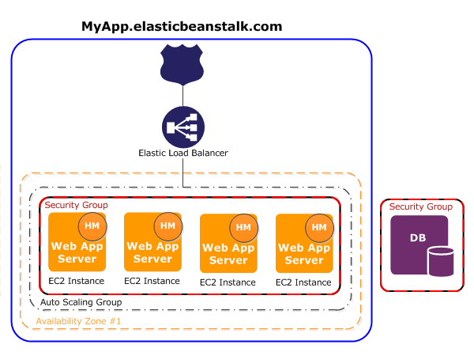

main.ts에 process.env.PORT 입력 확인 (env파일에 관련값 3000 적용)
- elastic beanstalk(EB)에서 process.env.PORT로 3000번을 입력할 것이다.
- 프로젝트 루트경로에 파일명 procfile 생성
    - 아래 정보 입력
        - nodejs에서는 실행파일명이 nodeApp.js를 실행한다.
        - web인 이유는 환경생성 화면에서 환경티어를 웹 서버 환경으로 선택하였기 때문이다.
        - 해당 커맨드로 실행시킨다.
```
	web: npm run start:prod
```
- 이제 `pnpm build`를 실행한 다음, 해당 프로젝트가 담긴 폴더로 이동하여 node_modules를 제외한 모든 파일을 압축한다.
- EB -> 환경 -> '생성한 환경'으로 들어와서 구성(configuration)으로 이동
    - 하단의 업데이트, 모니러팅 및 로깅 -> 편집 클릭

  
  

- 하단의 환경 속성 클릭해 변수명 직접 입력
    - main.ts에 process.env.port가 적혀있어야 한다.
    - 전부 입력 후 적용하면 로딩이 끝날때까지 기다린다.
      

- 로딩이 끝난 다음 EB -> 환경 -> "생성한 환경명" 에서 도메인을 클릭하면 다음 화면이 뜬다. EB가 성공적으로 업로드 되었다.
  
- 로딩이 끝난 다음 EB -> 환경 -> "생성한 환경명" 에서 업로드 및 배포를 눌러 이전에 압축한 폴더를 업로드한 다음 배포를 누른다.
    - 업로드 버전명이 자동으로 생성되며 업로드시 숫자가 자동으로 올라간다.
      
      
- 업로드가 실패한 경우: 업로드한 압축 파일명이 한글일 때
    - 영문으로 변경하고 다시 올린다: 실패
    - 압축전에 테스트용 영상들을 제외하고 압축한다: 실패
    - procfile 입력이 안되었다. 다시 입력하고 재빌드: 실패원인중 하나였으나 실패
    - EB -> 환경 -> '생성한 환경'으로 들어와서 구성(configuration)에서 환경변수 입력
    - 환경을 지우고 새로 환경을 생성 -> 업데이트, 모니터링 및 로깅 구성에서 환경변수 입력 -> 새로운 환경에 다시 배포시도
      `Instance deployment: 'npm' failed to install dependencies that you defined in 'package.json'. For details, see 'eb-engine.log'. The deployment failed.`
- 노드 버전 이슈로 추측함